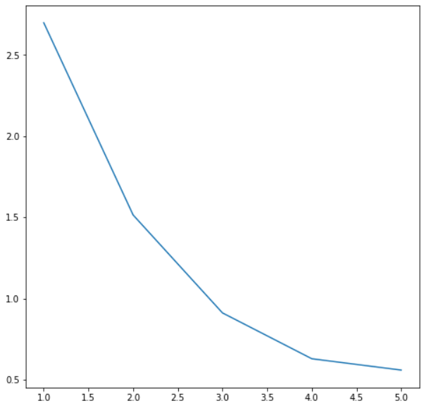
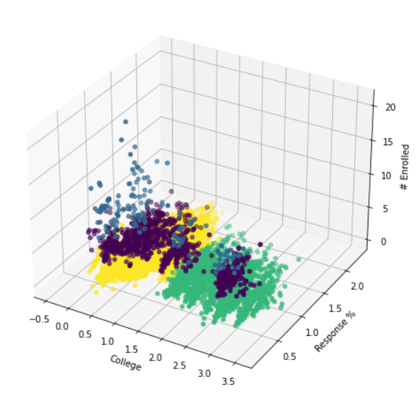

# Applying Data Science to CU's Course Schedule

This repository holds the Jupyter notebook I wrote as the submission for my Advanced Data Science class's final project. The overall purpose of the code is to provide CU Boulder class recommendations based on a class input. The data comes from Faculty Course Questionnaires that students fill out for their enrolled classes every semester. The text below is the write-up that I created to describe my project in full detail.

## Introduction

Every semester, CU Boulder gives students the choice to fill out FCQ questionnaires to rate the classes they’re currently enrolled in. A good portion of students likely believes this data is unused once collected because it isn’t obvious where it goes. As far as public access goes, one of two ways to see it in use is on the class search site. Selecting any class on the classes.colorado.edu site allows students to view FCQ results under Course Evaluations. However, the visualizations are a bit hard to understand on this site, and no details are provided regarding the relation of a class or instructor to other classes or instructors. The second way to access the FCQ data is even less lucrative, which requires one to look in the FCQ spreadsheet. Each row is identified by a course ID, title, and instructor, but the course data is represented by numbers with different ranges. Furthermore, there are thousands of rows to scroll through, so it can be difficult to find a specific class or instructor.

Wouldn’t it be great to have a way to sift through all this data, get results from it, and use those results to find similar classes to an inputted class? Luckily for data scientists like us, spreadsheets containing data can easily be parsed and analyzed using Python tools. The goal is to take the FCQ class data and perform data science algorithms on it to get some measure of similarity between classes as a result. Ideally, a user could enter a class that they enjoyed and obtain an output of the top similar classes. On the other hand, if a user did not enjoy a specific class, they could enter that and would receive a list of classes to avoid.

## Data

The data used for this project comes from the Boulder FCQ Report link found at colorado.edu/fcq. The spreadsheet contains data from every class offered at CU Boulder from Fall 2020 until Fall 2021. The columns of the data specify certain class identifiers, such as the year and semester the class was offered, the course ID, title, and department, and the instructor that taught it. Some columns provide statistical data, such as the number of students enrolled, results of the FCQ questionnaire (which are spread across 16 columns), and the percentage of the class that responded to the questionnaire. Every unique class offered by every unique professor is represented by a row in the spreadsheet, and there are about 22,000 rows in total. Some of these rows can be excluded since a professor can teach the same class multiple times during a single semester. Additionally, I’ll only be considering undergraduate classes since I’d like to test the accuracy of the results against my own opinions and that’s difficult to do with graduate-level classes as I haven’t taken any. Graduate classes only account for about 4,000 rows of the data, so excluding them is a good way to simplify the data. After pruning the data of graduate classes, duplicate class/instructor combinations, and some outliers in the column that represents the number of students enrolled, the data contains around 12,000 rows. This amount is large enough to gather good results without being too large for the algorithms to work properly.

## Real-world

Recommendation systems have been on the rise recently, especially in the last decade. Platforms like Spotify and YouTube track how long a user watched a video or listened to a song and use that data to recommend similar content in the future. As far as class recommendation systems for any college, I was not able to find any implementation online that works the way that the introduction describes. I am certain that there is no public implementation of this for CU Boulder specifically, but the school has posted some static recommendations for all students in general. Additionally, users on the CU Boulder Reddit page will occasionally post some recommendations based on classes they’ve taken in the past, which can be helpful but outdated at times. The website Rate My Professors allows students to leave reviews for instructors that have taught their courses in the past. The problem with this system is that reviews are extreme for the most part, meaning students are more likely to post a review when they had either an extremely good experience or an extremely bad one with a professor. Students that felt somewhere in the middle will likely not visit Rate My Professors to leave a review.

The experience that a student has with a professor is also subjective. For example, one student may value a class that gives them barely any homework and guarantees that they will leave the class with an A. Another student might value a class that is more rigorous but gives them a sense of accomplishment for learning valuable knowledge. If both students take a class with a professor that gives out little homework and doesn’t grade students strictly, their reviews of the professor will probably be opposite of each other. The same is true if both students take a class with a professor that has them constantly working throughout the semester and grades them poorly if they become lazy with their work.

Each student will be different in the types of classes they value most. The advice found on a generic, static recommendation site or a review/forum site will not take these values into account. Right now, recommendations found online depend on how other students liked or disliked the class, not on how the student looking for recommendations would like it. A student would instead need a platform that gives them class recommendations, takes input on how good or bad the recommendation was after the student completes the class, and then improves on itself based on this rating so that it can give the same student better recommendations in the future. No platform does this at the moment; at least not for CU Boulder specifically. This project is meant to act as the primary step in creating a platform like the one mentioned: modeling class reviews using data science tools to produce resulting class recommendations.

## Methods

The primary data science methods used in this project were PCA for dimension reduction and k-means clustering. Before any filtering or computation, the dataset had 32 unique columns. I took out the columns that identify the course (since I can plug the results back into the dataset to figure this out later) and any redundant data columns (I kept the response % column and took out the response # column), and I was left with 6 columns. The idea was to represent all columns as numerical data, so I would have to convert each text column to a number column using a dictionary to keep track of which number represented which instructor, college, department, etc. Then I would normalize the data and run the PCA algorithm on it to determine the top three principle columns from the resulting eigenvectors. Afterward, I could reduce the data to depend only on the principal columns, run k-means clustering on the result to group the classes by a similarity distance, and graph the result to see the visual clusters the algorithm decided on. I would then have a selection of assignments to categorize my classes by. If a user were to enter a class at this point, the program would ideally check the cluster that the entered class belonged to and output other classes within the cluster.

This model would achieve many results that the project is looking to answer. It is designed to cut down on the number of dimensions provided by the FCQ spreadsheet to determine the columns that have the most impact on the data, and then cluster by these columns to make groups of classes where the data does not vary significantly. This means that each class in a given cluster would all be similar to each other and would hopefully provide good recommendations to the user.

## Results

After removing the identifying columns, converting the rest of the data to a numeric matrix, and normalizing the data, I passed it through a PCA algorithm to determine the principal columns using the resultant eigenvectors. These columns were the college, the number of students enrolled, and the response percentage. Those were the most crucial to the dataset, so I passed them through the k-means clustering algorithm to group them by similarity. Once I did, I had a figure to show where each data point belonged to each cluster. I ran the k-means clustering algorithm on the data from values of k ranging from 1 to 5 and plotted the result of the mean error. From the below figure, it seems that an equal-sized elbow occurs at values of k equalling 2, 3, and 4, so I picked 4 because it looked the best visually on the graph.

  

  Figure 1: Elbow plot of different k-means values

  

  Figure 2: k-means on College, Response %, and # Enrolled

After the clusters had been formed, I computed which cluster my chosen class was in, found its location based on the principal dimensions, and computed the location of each neighbor in the same cluster. Then I computed which three neighbors were the smallest distance away from my chosen class, meaning that they were the most similar in terms of the college, the number of students enrolled, and the percentage of students out of the class that responded to the FCQs. I found that for an input of Advanced Data Science with Zach Mullen, the three most similar classes were Thermodynamics 2, Hydraulic Engineering, and Component Design respectively. A student taking computer science courses would probably not be able to take Thermodynamics 2 without some prerequisites first, so the advanced recommendation system implementation would have to consider which classes a student has taken previously before outputting a certain class. If the class was a top recommendation, like Thermodynamics 2 was in this case, then the system could calculate how similar the prerequisite courses were and choose to recommend them as well.

## Conclusion

The results determine that we have a pretty good model to start a class recommendation system! The college constraint was a great dimension to keep because it means that a large amount of recommended classes will be within the same college as the inputted class. This means that we probably wouldn’t see a class like Intermediate Italian Reading from an input of Calculus 3 simply because the number of enrolled students and response rate were similar. To turn this model into the fully-developed application discussed in the real-world section, where students would be able to receive recommendations on classes to take or to avoid, more implementation would be required to learn from student feedback on the recommendations themselves. This would look something like a neural net problem, where each recommendation would have a reward assigned based on how good or bad it was. If the recommendation was good, the algorithm would be given a positive reward and be trained to prioritize whatever method was used to create that recommendation. If the recommendation was poor, the algorithm would get a negative reward and be trained to avoid the method used to produce the result.

Ultimately, the point of this implementation, and even the model featured in this write-up, was to create an application for the FCQ data that CU Boulder gathers from its students every semester. The questionnaire is seemingly useless to some students, so it would be beneficial to publicly display the results to the students in a way that encourages them to fill out the forms. Even though FCQs may have great use among faculty and the school board at the moment, students do not have any direct incentive to fill them out. Thus, some public application that shows students how their ratings are used that utilizes the data more effectively than the class search implementation could help encourage students. A fully-fledged recommendations system could be highly beneficial to both students and CU Boulder, and if it could improve on its recommendations over time, it would continue to benefit the school far into the future.
